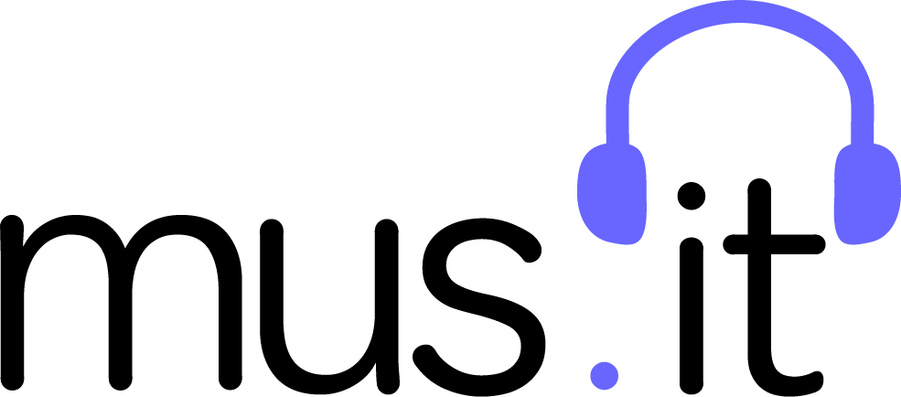

# 

A music playlist forum.


### Table of Contents
* [About the Project](#abouthteproject)
    * [Key Features](#keyfeatures)
    * [Built With](#builtwith)
* [Getting Started](#gettingstarted)
    * [Prerequisites](#prerequisites)
    * [Installation](#installation)
* [Usage](#usage)
* [Contributing](#contribution)
* [License](#license)
* [Contact](#contact)
* [Acknowledgements](#acknowledgements)

## About the Project
mus<span>.</span>it is a forum for sharing your music taste through playlists. Users can create their own playlists to share with the community. Users can also like and comment on other users' playlists.

### Key Features
* Private user accounts to save playlists created with user's email and password.
* Genre categories to organize and display exisiting playlists.
* Edit playlist capabilities.
* Save playlists created by other users with a 'like' button.
* Interact with playlists and other users through comment feature.

### Built With
* [Node.js](https://nodejs.org/en/)
* [Handlebars.js](https://handlebarsjs.com/)
* [MySQL](https://www.mysql.com/)
* [Express.js](https://expressjs.com/)
* [bcrypt](https://www.npmjs.com/package/bcryptjs)
* [Sequelize](https://sequelize.org/)
* [Bootstrap](https://getbootstrap.com/)

## Getting Started
Follow these instructions to run mus_it locally:

### Prerequisites
This project requires [Node.js](https://nodejs.org/en/) and a SQL server, like [MySQL](https://www.mysql.com/).

### Installation
First, clone or download the code base [here](https://github.com/Demsley1/musit_2).

From your CLI, navigate into the root directory of the codebase. Run the following code block:

```
npm install
```

Open the project in your code editor, add a .env file containing your local server name, username, and password.

Once you start your server, the project is ready to launch.

## Usage
To use mus<span>.</span>it online, visit [mus.it](https://still-ridge-48307.herokuapp.com/). 

You can view exisiting playlists.


To like, comment, or make your own playlist, begin by creating a user profile.


Then, navigate to your dashboard and click 'Create Playlist'. A form will prompt you through the steps.


Enjoy your new music community!

## Contributing
mus<span>.</span>it was built by group-e of Columbia Engineering's Full-Stack Coding Bootcamp.

Each person contributed concepts and code throughout the development process. Explore group-e's repositories to see what else we're up to:

* [Denva Emsley](https://github.com/Demsley1)
* [Rebecca Byrne](https://github.com/RPB543)
* [Brandon Diaz](https://github.com/1Clide1)
* [Christian Diaz](https://github.com/Christian55diaz)
* [Lelah Bates Childs](https://github.com/labchild)

## License
mus<span>.</span>it is an open-source project created by blossuming 🌸 full-stack developers. License ISC &copy;2022 by group-e.

## Acknowledgements ❣️
Group-e would like to thank our instructional team at Columbia Engineering Full-Stack Coding Bootcamp for their enduring support!

### Want to Help?
Do you see something we missed or a more succint and effective way this code can be written? Great! Please reach out to any of the contributors and let us know how we can improve. Thanks in advance for your tips, tricks, and pointers!